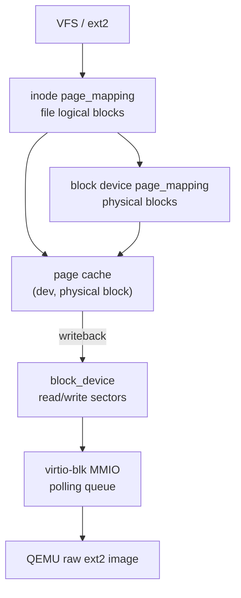
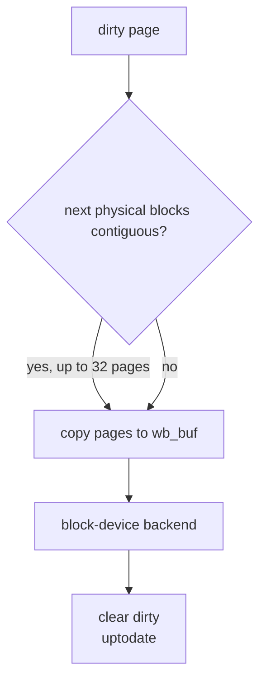
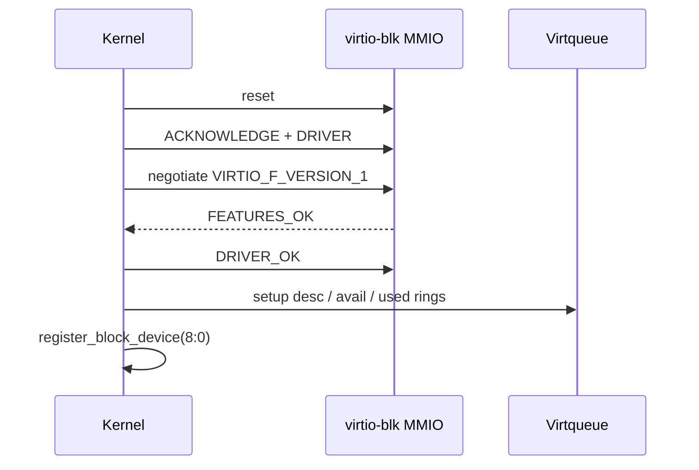

# 块设备与页缓存架构

块层连接文件系统和具体设备驱动。普通运行时的存储栈由块设备注册表、统一 4 KiB
page cache、后台 writeback 和 virtio-blk MMIO 轮询驱动组成。内核自测不装配这条
真实存储栈，而是在相同接口上使用内存 fixture 验证内核机制。

## 代码边界

主要文件：

- `include/kernel/blkdev.h`：块设备抽象。
- `block/blkdev.c`：块设备注册、查找、块设备 page_mapping。
- `include/kernel/page_mapping.h`：page cache 命名域和后端 ops。
- `include/kernel/page_cache.h`：page cache 公共 API。
- `block/page_cache.c`：缓存页生命周期、LRU、hash。
- `block/page_cache_dirty.c`：dirty list。
- `block/page_cache_writeback.c`：同步和聚合写回。
- `block/page_cache_alias.c`：logical mapping 与 physical page 的内部关联索引。
- `block/virtio_blk.c`：QEMU virtio-blk modern MMIO 驱动。

文件系统只能通过 block device/page cache 发起 I/O；驱动只实现扇区读写，不知道 VFS 或 ext2。

## 自测边界

`test/io/memory_fixture.[ch]` 提供两个测试 Adapter：一个注册到 block-device
接口的内存设备，以及一个带 regular-file `struct file` 和 page mapping 的合成文件。
它们让 KTEST 可以验证 page-cache identity、dirty/writeback、alias、reclaim、
同步和文件映射等机制，而不需要路径树、挂载点、on-disk ext2 格式或 MMIO 设备。

因此 `KERNEL_SELFTEST=1` 只执行 `vfs_init()`，不会执行
`filesystems_init()`、`virtio_blk_init()` 或 `vfs_mount_root()`。ext2 的磁盘格式、
路径和挂载语义，以及 virtio-blk 驱动与真实块设备的集成，由用户态程序从测试
rootfs 运行时通过 `make utest` 验证；普通 `make qemu` 仍使用同一 ext2 + virtio-blk
启动路径。

## 块设备抽象

`include/kernel/blkdev.h` 定义：



```c
struct block_device_operations {
    int (*read_sectors)(struct block_device *bdev, void *buf,
                        uint64_t sector, uint32_t nsec);
    int (*write_sectors)(struct block_device *bdev, const void *buf,
                         uint64_t sector, uint32_t nsec);
};

struct block_device {
    dev_t bd_dev;
    uint64_t bd_sectors;
    const struct block_device_operations *bd_ops;
    void *bd_private;
    struct page_mapping bd_pages;
};
```

单位：

- sector：512 字节。
- block/page cache page：4 KiB。
- `BLOCK_SECTORS = 8`。

注册 API：

```c
int register_block_device(struct block_device *bdev);
struct block_device *lookup_block_device(dev_t dev);
struct page_mapping *block_device_pages(dev_t dev);
```

设备表是固定数组 `dev_table[32]`，以 major number 为索引。virtio-blk 使用 major 8。

## 块设备 page_mapping

注册块设备时，`register_block_device()` 初始化 `bdev->bd_pages`：

```c
page_mapping_init(&bdev->bd_pages, bdev, bdev->bd_dev, &block_mapping_ops);
```

块设备 mapping 的 index 是 4 KiB 物理块号。其 ops：

- `resolve()`：逻辑块号就是物理块号；实际扇区 I/O 由 page-cache 集中执行。

ext2 metadata 读取直接经 `page_cache_get_block(dev, block)` 按物理块访问；
块设备 mapping 的 `resolve()` 由 `ext2_ind_bmap_readonly()` 经
`block_device_pages()` + `page_cache_get_mapping()` 行使。

## page_mapping 抽象

`page_mapping` 是 logical-to-physical resolver；page-cache 的唯一物理身份是 `(dev_t, physical block)`：

```c
struct page_mapping {
    void *host;
    dev_t dev;
    const struct page_mapping_ops *ops;
};
```

`page_mapping_ops`：

```c
struct page_mapping_ops {
    int (*resolve)(struct page_mapping *mapping,
                   uint64_t index, bool create,
                   uint64_t *block);
};
```

命名域区别：

| mapping | host | index 含义 |
| --- | --- | --- |
| inode `i_pages` | `struct inode` | 文件逻辑块号 |
| block device `bd_pages` | `struct block_device` | 磁盘物理块号 |

page cache 只看 `(dev_t, physical block)`；mapping 只解释 ext2 logical block tree。关联、dirty、引用和回收细节隐藏在 page-cache implementation。

## page_cache 对象

`struct page_cache` 的公开接口只暴露数据和同步操作；设备号、物理块号、
引用计数、dirty/writeback 状态以及关联索引均为实现细节。
- `refcount`
- `uptodate`
- `dirty`
- `writeback`
- `dropped`
- hash/LRU/dirty list 节点；mapping 关联在独立 `struct page_cache_assoc` 中。

全局限制：

```c
#define PAGE_CACHE_HASH_BITS 7
#define PAGE_CACHE_NR_PAGES 512U
```

缓存 key 的 hash 混合设备号和物理块号；同一 `(dev_t, block)` 永远只有一个 authoritative page。

## page cache API

公共 API：

```c
struct page_cache *page_cache_get(dev_t dev, uint64_t block,
                                  uint32_t flags, int *error);
struct page_cache *page_cache_get_mapping(struct page_mapping *mapping,
                                          uint64_t index,
                                          uint32_t flags,
                                          int *error);
struct page_cache *page_cache_get_block(dev_t dev, uint64_t block);
void page_cache_put_page(struct page_cache *page);
uint8_t *page_cache_data(struct page_cache *page);
void page_cache_mark_dirty(struct page_cache *page);
int page_cache_sync_page(struct page_cache *page);
int page_cache_sync_mapping(struct page_mapping *mapping);
int page_cache_sync_inode(struct inode *inode);
int page_cache_sync_all(void);
void page_cache_truncate_mapping(struct page_mapping *mapping, uint64_t size);
void page_cache_invalidate_mapping(struct page_mapping *mapping);
```

`PAGE_CACHE_CREATE` 控制是否允许创建物理页，`PAGE_CACHE_READ` 请求设备读入内容。mapping 只解析 logical block；它不执行设备 I/O。

调用者拿到 page 后必须 `page_cache_put_page()`。

## LRU 与回收

page cache 满 512 页时：

1. 优先从 LRU 找 refcount 为 0、非 dirty、非 writeback 的 clean 页释放。
2. 无 clean victim 时取 dirty 链表头执行 `page_cache_sync_page()` 单页写回，
   不检查引用与写回状态；已处于 writeback 的 dirty 页返回 `-EBUSY`。

victim 在 `page_cache_lock` 内只从 hash/LRU/association/dirty 结构摘除并标记
`dropped`；page、data page 和 association 对象在解锁后释放。page-cache miss 的
page/data 以及 association 对象也都在锁外预分配，发布前在锁内重新检查物理 identity。
当前仍没有 busy/in-flight 状态，因此这不是 SMP 并发填充协议。

关联移除路径仍改为清 dirty 并置 `uptodate=false`；这只影响 mapping 关联，不会
在 `page_cache_lock` 内释放物理 page。

## dirty list

dirty 状态维护一个全局链表：

- 全局 `page_cache_dirty_list`：后台 writeback 使用。

局部 fsync 通过 logical association 过滤该链表，不会把其他 mapping 的
dirty page 一并写回；全局同步才允许跨 mapping 聚合物理连续页。

`page_cache_mark_dirty()` 也会把页面标记为 uptodate。dirty non-uptodate 页会导致未定义数据写回，因此被禁止。

## writeback

`page_cache_sync_page(page)` 同步单页：设置 `writeback=true`，通过物理页的
`(dev_t, block)` 身份调用 block-device backend；成功后清 dirty，失败时保留
data 和 dirty 以便重试。不经 wb_buf，无聚合。

`page_cache_wb_run(start, mapping)` 做保守聚合：



聚合流程：

- 从同一设备的物理块开始。
- 收集物理块号连续的 dirty 页。
- 如果 `mapping` 非空，只收集同一 logical mapping 关联的页面；
  `page_cache_sync_all()` 传入空 mapping，才允许跨 mapping 聚合。
- 最多写入 32 页（`PAGE_CACHE_WB_MAX`），缓冲按 order-5 分配，失败退化为单页。
- 调用一次 block-device backend 写连续范围。

后台线程 `page_cache_wb_thread()` 通过 `worker_run_periodic(5, ...)` 每 5 秒调用 `page_cache_sync_all()`。

## logical association 一致性

同一个物理页可以有多个隐藏的逻辑关联：

- ext2 inode mapping：文件/目录 logical block resolver。
- block device mapping：物理块 raw resolver，用于 metadata 或调试读取。

inode logical mapping 与 raw physical mapping 通过同一个 `(dev_t, block)` page 共享数据。

写回成功后无需刷新第二份 page，因为不存在第二份 authoritative page。

mapping 解除只移除内部关联；物理页生命周期由 page-cache 引用、dirty 和 writeback 状态决定。

这避免引入双缓存一致性协议，同时保证所有已驻留关联立即观察到相同数据。

## virtio-blk 驱动

`block/virtio_blk.c` 实现 QEMU virtio-blk MMIO modern 传输层，轮询模式。初始化状态机：



```text
reset
  -> ACKNOWLEDGE
  -> DRIVER
  -> feature negotiation: VIRTIO_F_VERSION_1
  -> FEATURES_OK
  -> DRIVER_OK
  -> setup queue 0
  -> register_block_device()
```

代码在队列装配前就置 DRIVER_OK，与 virtio 规范建议的顺序不同。

驱动只使用 request virtqueue，静态分配：

- descriptor table
- avail ring
- used ring
- request header/status
- block_device 实例

单次 I/O 使用 3 个描述符：

```text
request header -> data buffer -> status byte
```

读写 API 通过 block device operations 暴露：

```c
read_sectors(bdev, buf, sector, nsec)
write_sectors(bdev, buf, sector, nsec)
```

驱动要求 buffer 位于内核直接映射区，因为它通过 `__pa()` 把缓冲区地址交给设备。

## 轮询 I/O

`virtio_blk_rw()` 参数校验后：

1. 填 request header。
2. 填 3 个 descriptor。
3. 将 head descriptor 放入 avail ring。
4. memory barrier。
5. 更新 avail idx。
6. 写 `QUEUE_NOTIFY` kick 设备。
7. 自旋等待 used idx 到达 expected。
8. memory barrier。
9. 检查 status byte。

有自旋上限 `VBLK_POLL_SPIN_LIMIT`。超限会 panic，避免设备失速导致内核静默挂起。

当前同一时刻只有一个 in-flight 请求，因此静态 ring 和 request 结构足够。

## 普通启动的初始化与 rootfs

`kernel_main()` 中：

```text
vfs_init()
filesystems_init()
virtio_blk_init()
vfs_mount_root(ROOT_DEV)
```

这是普通内核的启动路径。KTEST 在 `vfs_init()` 后停止，不执行后三个存储初始化
步骤，也不创建 rootfs。

顺序要求：

- VFS 先准备文件系统注册和 cache。
- 内建文件系统注册为 filesystem type Adapter。
- virtio-blk 注册 major 8 block device。
- VFS rootfs probe 和选中文件系统的 mount 通过 `lookup_block_device()` 和
  page cache 读取 super block。

## 设计约束

- 文件系统不能直接调用 virtio MMIO，只能通过 block device operations。
- page cache key 必须始终是 `(dev_t, physical block)`；logical mapping 只负责解析。
- inode 与 raw block 访问共享同一个 physical authoritative page。
- dirty list 只维护全局链表；mapping 关联索引必须与 page 生命周期同步维护。
- virtio-blk 当前是轮询单请求模型，引入中断或多请求队列需要重新设计同步和 buffer 生命周期。
