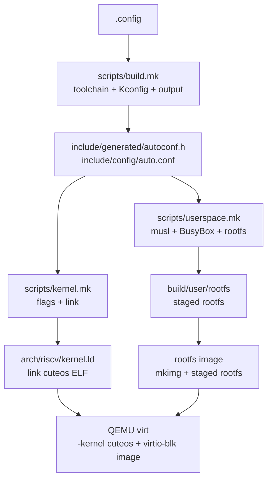
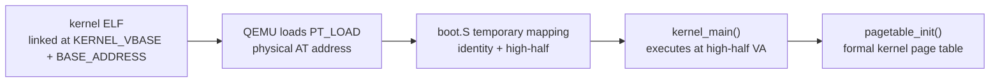

# 构建与链接架构

本文描述 cuteOS 构建系统如何组织内核对象、用户程序、链接脚本、Kconfig 和 QEMU 镜像。顶层 `Makefile` 只提供稳定入口；所有构建编排由 `scripts/` 下的五个 Make module 实现。

## 顶层 Makefile 结构

顶层 `Makefile` 只设置默认目标并引入构建入口：



```make
include scripts/build.mk
```

其中：

- `scripts/build.mk` 选择工具链、管理输出目录与静默输出，并生成或引入 Kconfig 配置。
- `scripts/filelist.mk` 定义各模块源文件对象清单和自测对象发现。
- `scripts/kernel.mk` 定义内核编译/链接策略，并聚合 `filelist.mk` 的清单为 `OBJ_REL`。
- `scripts/userspace.mk` 构建 musl、compiler-rt、BusyBox、staged rootfs 与 ext2 镜像。
- `scripts/workflows.mk` 提供 QEMU、测试、开发辅助和清理目标。
- `scripts/tools/` 存放 ELF 检查、符号生成、镜像制作、测试运行和 BusyBox 配置工具。

`scripts/kernel.mk` 将各组对象聚合为 `OBJ_REL`：

```text
ARCH_OBJS
INIT_OBJS
KERNEL_OBJS
MM_OBJS
FS_OBJS
BLOCK_OBJS
DRIVER_OBJS
SCHED_OBJS
SYSCALL_OBJS
KERNEL_TEST_OBJS
LIB_OBJS
```

普通构建中 `KERNEL_TEST_OBJS` 为空。`make ktest` 递归执行
`KERNEL_SELFTEST=1 OUTROOT=build/test` 构建，此时 `scripts/filelist.mk` 递归发现
`test/` 下的 `.c/.S` 文件并填充
`KERNEL_TEST_OBJS`。测试执行顺序由 `test/test.c` 的显式 registry 决定，不依赖
链接顺序。

`KERNEL_SELFTEST` 同时进入 CFLAGS 和 ASFLAGS。除链接测试对象外，它还让
`init/main.c` 创建 self-test 内核线程，而不是创建 PID 1。普通构建和测试构建
都使用 8 KiB 启动栈；深层回归路径运行在 self-test 线程的普通 task 栈上。
`make ktest` 不构建测试 rootfs，也不向 QEMU 附加 virtio-blk 设备；它只运行
内核 ELF。需要后端的 page-cache、writeback 和文件映射用例使用
`test/io/memory_fixture.[ch]` 提供的内存 block/file fixture，因此不会触发
`scripts/userspace.mk`、ext2 镜像制作或 BusyBox 构建。

held-lock、`preempt_count` 和 allocator context 的不可恢复错误由独立的
`make kpanic CASE=<case>` harness 验证。它为每个 case 使用独立的
`build/kpanic/<case>` 输出目录，在 QEMU 中观察预期 panic；allocator 相关
case 包括 `alloc-held-lock`、`alloc-free-held-lock`、`alloc-hard-irq` 和
`alloc-sleepable-irq-off`；其余 context case 包括
`preempt-underflow`、`preempt-overflow`、`spinlock-wrong-unlock`、
`spinlock-recursive` 和 `spinlock-capacity`。这些故障注入不属于 `make ci`。

用户态回归由 `make utest-build` 构建独立的 static musl 测试 ELF 和测试
rootfs；`make utest` 从该镜像启动 BusyBox init，并只执行
`/usr/lib/cuteos-tests/utest-runner`。该 runner 在每个 case 的独立子进程组中
执行、清理 fixture，并在完成后请求关机。`make ci` 先运行 `make ktest`，
再串行运行 `make utest`。

新增生产源文件时必须更新 `scripts/filelist.mk` 的对象清单，否则不会进入内核链接。
新增内核自测文件时放入 `test/<subsystem>/`，由同一 module 自动发现。

## 编译标志

内核编译参数由 `scripts/kernel.mk` 定义。核心约束包括：

- 架构：`-march=rv64gc -mabi=lp64 -mcmodel=medany`
- 标准：`-std=gnu23`
- freestanding：`-ffreestanding -fno-common -nostdlib -nostdinc`
- 非 PIE：`-fno-pie -no-pie`
- include 路径：`include` 和 `arch/riscv/include`
- 全局预包含：`include/generated/autoconf.h`、`include/kernel/compiler.h`

`CONFIG_LTO=y` 时，内核链接器从 `ld` 切换为 `$(CC)`，并通过 `-Wl,-T,arch/riscv/kernel.ld` 使用同一个链接脚本。`arch/riscv/lib/*.S` 通过 `ASFLAGS` 编译，本身不会生成 LTO 中间表示；其余 C 对象通过 `CFLAGS` 接受 `-flto=auto`。

## 内核链接布局

内核链接脚本是架构目录下的 `arch/riscv/kernel.ld`。关键常量为：



```ld
BASE_ADDRESS = 0x80200000;
KERNEL_VBASE = 0xFFFFFFC000000000;
. = KERNEL_VBASE + BASE_ADDRESS;
```

这意味着：

- 内核 ELF 的链接地址在高半区。
- 物理加载地址以 `AT(ADDR(section) - KERNEL_VBASE)` 表示。
- QEMU `-kernel` 将 ELF 加载到物理内存后，`boot.S` 负责启用高半区映射并跳转。

链接脚本生成四类 PT_LOAD：

| 段 | 权限 | 内容 |
| --- | --- | --- |
| `text` | `R/X` | `.text.entry`、`.text*` |
| `rodata` | `R` | `.rodata*` |
| `data` | `R/W` | `.data*`、`.sdata*`、`__global_pointer$` |
| `bss` | `R/W` | `.sbss*`、`.bss*`、COMMON |

`.text`/`.rodata` 结束与 `_end` 按 4 KiB 对齐；`.bss` 段起点仅 8 字节对齐。
`_end` 作为 early allocator 的起点参考。

## 架构对象

`scripts/filelist.mk` 的 RISC-V 对象清单当前包含：

```text
arch/riscv/boot.o
arch/riscv/entry.o
arch/riscv/switch.o
arch/riscv/trap.o
arch/riscv/task.o
arch/riscv/trap_init.o
arch/riscv/timer.o
arch/riscv/plic.o
arch/riscv/sbi.o
arch/riscv/mm/page_table.o
arch/riscv/mm/user_map.o
arch/riscv/mm/tlb.o
arch/riscv/lib/softfloat.o
arch/riscv/lib/string.o
```

这些对象拥有 CPU、页表、CSR、trap frame 和上下文切换语义。通用子系统不应直接复制这些低级细节，而应通过 `include/kernel/*` 或 `arch/riscv/include/arch/*` 的 facade 调用。

## Kconfig 生成物

`scripts/build.mk` 以 `Kconfig` 和架构/子系统 Kconfig 文件生成：

- `.config`
- `include/config/auto.conf`
- `include/config/auto.conf.cmd`
- `include/generated/autoconf.h`

仅内核编译预包含 `include/generated/autoconf.h`。配置影响用户态构建的途径是该头的时间戳依赖触发 rootfs 重建，而非预包含。

`KCONFIG_SKIP_GOALS` 让 `clean`、`help`、`format`、`defconfig` 等目标不强制
要求已有配置。

## 用户态构建

用户态构建由 `scripts/userspace.mk` 管理。它固定构建
静态 musl BusyBox 1.36.1：BusyBox `/sbin/init` 作为 PID 1，提供 `/bin/sh`
和选定 applet。它公开三个递进目标：`make user` 生成 BusyBox ELF，
`make user-rootfs` 生成 staged rootfs，`make user-image` 生成 ext2 镜像。
外部构建分为两个深模块：

1. `scripts/userspace.mk` out-of-tree 构建 musl `v1.2.6` sysroot，并将
   `user/linux-uapi/include/` 中经筛选的 Linux UAPI 头安装到该 sysroot。
   sysroot 固定 `rv64imac_zicsr_zifencei/lp64`、static 和 non-PIE。用户态
   明确禁止 RISC-V F/D ISA 扩展；所有浮点运算必须降低为 compiler-rt
   soft-float builtins，不能依赖内核保存浮点寄存器状态。UAPI 头仅提供
   编译期 ABI 声明；每个接口的运行时语义仍须以 syscall/driver 文档和测试为准。
   同一模块还调用 Zig 0.16+ 的 `build-lib -fcompiler-rt`，生成 soft-float
   `libcompiler_rt.a`。它只提供 GCC 工具链缺失的 compiler builtins，不提供另一套
   libc。
2. 同一 module 使用 BusyBox 自己的 Kbuild 与项目
   `configs/busybox_defconfig`，通过项目 musl crt/libc 和 compiler-rt 链接。

BusyBox 配置启用 `INIT`、`FEATURE_USE_INITTAB`、`FEATURE_INIT_SCTTY` 和
`ASH_JOB_CONTROL`。rootfs 安装的 `/etc/inittab` 使用
`::respawn:-/bin/sh`：BusyBox action child 先建立新 session，继承 PID 1 的
console fd 0，再因命令前导 `-` 调用 `TIOCSCTTY`。shell 退出后由 PID 1 respawn。

项目 musl GCC specs 明确移除主机 `lp64d` 的 `crtbegin/crtend/libgcc`，只使用
项目 musl crt 与 Zig 生成的 strict-`lp64` compiler runtime。最终 BusyBox
必须是 static、non-PIE、soft-float `ET_EXEC`，且 ELF ISA attributes 不得声明
F/D 扩展。`scripts/tools/check-user-elf.sh` 在链接后强制检查这些约束；该约束是长期
用户 ABI，不是临时构建限制。

## 内核产物

默认目标 `all` 构建 `$(OUTDIR)/cuteos`。链接后生成两个辅助文件：

- `cuteos.asm`：`objdump -S` 反汇编。
- `cuteos.sym`：符号表精简输出。

`CONFIG_KSYMS=y` 时构建分两阶段：

1. 链接 `cuteos.stage1`。
2. 用 `scripts/tools/gen-ksyms.sh` 从 stage1 符号表生成 `kernel/ksyms.generated.c`。
3. 将生成对象纳入最终链接。

## 用户态根文件系统镜像

`scripts/userspace.mk` 将 BusyBox 安装到 `$(USER_OUTROOT)/rootfs`。该 staged 目录是
rootfs 装配 Interface：它安装 BusyBox 本体、`/sbin/init` 与 applet symlink，
并安装 `/etc/inittab`；不会创建项目 `/init` 或用它覆盖 `/bin/init`。

内核自测不生成根文件系统镜像。`KERNEL_SELFTEST=1` 的 QEMU 命令只传入 kernel、
内存和 CPU 参数，不注册 virtio-blk 设备；真实 rootfs、ext2 和 virtio-blk 由普通
启动及用户态回归测试负责。

`$(KERNEL_IMG)` 再由 `$(MKIMG)` 将 staged rootfs 转换为 ext2：

```make
MKIMG_SIZE_MB=$(CONFIG_ROOTFS_IMAGE_SIZE_MB) $(MKIMG) \
    $@ $(USER_ROOTFS)
```

`scripts/tools/mkimg.sh` 不理解 libc、init、shell 或 applet，只处理完整目录树并补充不能由
普通用户在 host staging 目录创建的 `/dev/console` 和 `/dev/null` 设备节点。

QEMU 启动时使用：

```text
-drive file=$(KERNEL_IMG),if=none,format=raw,id=x0
-device virtio-blk-device,drive=x0,bus=virtio-mmio-bus.0
```

内核侧 `virtio_blk_init()` 将该设备注册为 major 8 minor 0。启动路径调用
`vfs_mount_root(ROOT_DEV)` 对该块设备探测已注册文件系统类型；当前构建脚本
生成的镜像为 ext2，因此会命中 ext2 Adapter 并挂载为 `/`。

## QEMU 启动参数

顶层 `Makefile` 的 QEMU 参数体现当前平台假设：

```text
-machine virt
-kernel build/.../cuteos
-m $(CONFIG_DRAM_SIZE_MB)M
-smp $(CONFIG_QEMU_CPUS)
-nographic
-global virtio-mmio.force-legacy=false
```

`virtio-mmio.force-legacy=false` 与 `block/virtio_blk.c` 的 modern virtio 1.x 初始化路径一致。驱动只协商 `VIRTIO_F_VERSION_1`。

这组 QEMU 存储参数只用于 `make qemu`、`make qemu-gdb` 和 `make utest` 的普通
内核启动。`make ktest` 使用无磁盘 QEMU，并通过内存 fixture 覆盖内核内部的 I/O
生命周期和 page-cache 机制。

## 构建边界

构建系统的所有权边界如下：

- 顶层 `Makefile` 只提供构建入口。
- `scripts/build.mk` 负责工具链、Kconfig 与共享构建设置。
- `scripts/filelist.mk` 负责内核对象清单；`scripts/kernel.mk` 负责编译/链接约束和分析。
- `scripts/userspace.mk` 负责完整静态 musl BusyBox 用户态与镜像。
- `scripts/workflows.mk` 负责运行、测试和开发工作流。
- `arch/riscv/kernel.ld` 定义 RISC-V 内核 ABI 布局。
- Kconfig 只通过生成头和 `auto.conf` 影响编译，不应在源码中硬编码可配置项的替代路径。

新增模块时，应同时考虑：对象清单、头文件边界、Kconfig 选项、链接布局和是否需要用户态测试程序。
