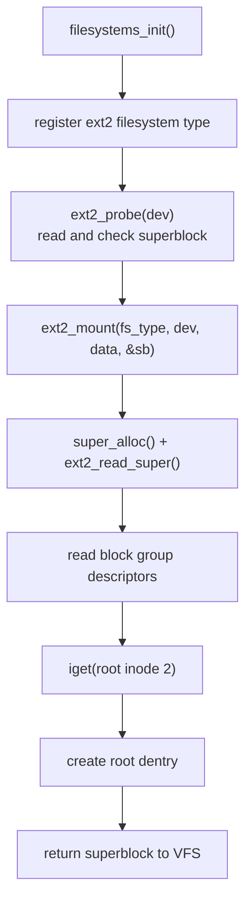
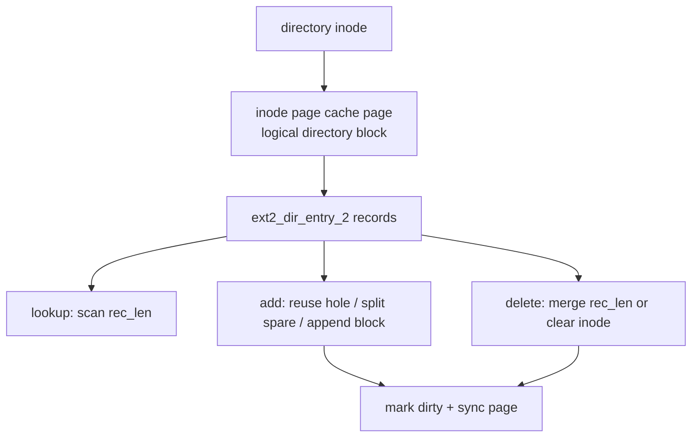

# ext2 文件系统架构

ext2 是 cuteOS 当前根文件系统镜像格式。它把磁盘格式、inode/block 分配、目
录项和文件数据块映射封装在 `fs/ext2/` 内部，并通过 VFS filesystem type
Adapter、inode operations、file operations 和 super operations 对外暴露。

## 代码边界

主要文件：

- `fs/ext2/ext2.h`：ext2 私有磁盘格式和内部 API。
- `fs/ext2/super.c`：注册、mount、super block、statfs、root inode。
- `fs/ext2/inode.c`：inode 读写、block mapping、truncate、inode ops 初始化。
- `fs/ext2/file.c`：普通文件读写和 inode page_mapping ops。
- `fs/ext2/dir.c`：目录查找、目录项变更、symlink、mkdir/link/unlink/rename。
- `fs/ext2/balloc.c`：块位图和 inode 位图分配/释放。

`fs/ext2/ext2.h` 不对 VFS 外部暴露。上层只通过 `struct inode_operations`、`struct file_operations` 和 `struct super_operations` 调用 ext2。

## 磁盘格式结构

ext2 私有头定义与磁盘布局一致的 packed 结构：

- `struct ext2_super_block`
- `struct ext2_group_desc`
- `struct ext2_inode`
- `struct ext2_dir_entry_2`

关键常量：

```c
#define EXT2_SUPER_MAGIC 0xef53
#define EXT2_ROOT_INO 2
#define EXT2_SUPER_OFFSET 1024u
#define EXT2_NAME_LEN 255
#define EXT2_NDIR_BLOCKS 12
#define EXT2_IND_BLOCK 12
#define EXT2_DIND_BLOCK 13
#define EXT2_TIND_BLOCK 14
#define EXT2_N_BLOCKS 15
```

当前文件系统块大小固定为 `BLOCK_SIZE=4096`。mount 时若 ext2 super block 的 block size 不是 4 KiB，会拒绝挂载。

## super block 私有状态

`struct ext2_sb_info` 挂在 `super_block.s_private`：

```c
struct ext2_sb_info {
    struct ext2_super_block s_es;
    struct ext2_group_desc *s_group_desc;
    uint32_t s_groups_count;
    uint32_t s_inode_size;
    uint32_t s_inodes_per_group;
    uint32_t s_blocks_per_group;
    uint32_t s_first_data_block;
};
```

block group descriptor table 通过 `vmalloc(bytes, ALLOC_NOWAIT)` 分配并读入内存。metadata block 的读取使用块设备 page cache：

```c
page_cache_get_block(sb->s_dev, block)
```

## probe 和 mount 流程

ext2 不拥有启动根挂载策略。启动路径通过 `filesystems_init()` 注册 ext2
filesystem type；VFS 对 root block device 调用 ext2 `probe(dev)`，命中后再
调用 ext2 `mount(fs_type, dev, data, &sb)`。



识别流程：

1. `ext2_probe(dev)` 读取固定位置的 ext2 superblock。
2. magic 不匹配返回 0，表示不是 ext2。
3. magic 匹配后，block size、inode size、group 参数或 feature bits 不支持时
   返回负 errno。
4. 支持的 ext2 superblock 返回正数。

挂载流程：

1. `super_alloc()` 分配 VFS super block。
2. `ext2_read_super()` 读取并校验 ext2 super block。
3. `ext2_read_bgdt()` 读取 block group descriptor table。
4. 分配 root dentry。
5. `iget(sb, EXT2_ROOT_INO)` 读取 root inode。
6. 设置 `sb->s_root` 并把 `super_block` 返回给 VFS。

挂载成功后，VFS root 指向 ext2 根目录。

当前写挂载只支持项目镜像使用的 feature 画像：

- `s_feature_compat == 0`
- `s_feature_incompat` 必须且只能包含 `EXT2_FEATURE_INCOMPAT_FILETYPE`
- `s_feature_ro_compat` 只能包含 `EXT2_FEATURE_RO_COMPAT_SPARSE_SUPER`

不支持的 feature bit 在 magic 匹配后视为 hard error，而不是 probe no-match。

## inode 读写

`ext2_inode_location()` 通过 inode number 定位磁盘 inode：

```text
group = (ino - 1) / inodes_per_group
index = (ino - 1) % inodes_per_group
byte_offset = index * inode_size
block = bg_inode_table + byte_offset / BLOCK_SIZE
offset = byte_offset % BLOCK_SIZE
```

`ext2_read_inode()` 从 inode table block 复制 raw inode 到 `ext2_inode_info`，再填充 VFS inode 字段：

- mode/uid/gid/nlink/size/blocks/timestamps
- 设备特殊文件的 `i_rdev`
- `i_op/i_fop/i_pages.ops/i_pages.dev`

`ext2_write_inode()` 反向把 VFS inode 状态写回 raw inode，并同步 metadata page。

## inode operation 初始化

`ext2_init_inode_ops()` 根据 inode mode 设置操作向量：

| 类型 | i_op | i_fop | i_pages |
| --- | --- | --- | --- |
| directory | `ext2_dir_inode_operations` | `ext2_dir_operations` | `ext2_inode_mapping_ops` |
| symlink | `ext2_symlink_inode_operations` | none | `ext2_inode_mapping_ops` |
| char/block device | none | none | none |
| regular/default | `ext2_file_inode_operations` | `ext2_file_operations` | `ext2_inode_mapping_ops` |

目录和块后备 symlink 在 page cache 看来都是 inode 数据页。设备特殊文件不通过 inode page cache 暴露数据。

`inode->i_pages.ops` 只负责 logical block 到 physical block 的解析与分配；
page-cache 负责实际物理 I/O 和唯一 authoritative page。

## 文件数据路径

普通文件读写位于 `fs/ext2/file.c`。


读取：

1. 根据 `pos/count` 限制到 `inode->i_size`。
2. 按文件逻辑块号 `lblock = pos / BLOCK_SIZE` 循环。
3. 通过 `page_cache_get_mapping(&inode->i_pages, lblock, PAGE_CACHE_READ, &error)` 获取物理页。
4. 从 page cache 数据拷贝到调用者缓冲区。

写入：

1. 限制到 `EXT2_MAX_FILE_SIZE`。
2. 经 `page_cache_get_mapping(&inode->i_pages, lblock, flags, &error)` 获取
   物理页：未覆盖整个块的写入带 `PAGE_CACHE_READ` 先读入已有内容，缺块时带
   `PAGE_CACHE_CREATE` 允许经 `ext2_resolve_block()` → `ext2_bmap()` 分配。
3. 写入 page cache，标 dirty。
4. 如果扩大文件，更新 `inode->i_size` 并 `ext2_write_inode()`。

写入不是每次都同步数据页；dirty page 由 fsync、truncate、msync 或后台 writeback 写回。

`fdatasync` 通过 VFS 同步 inode 数据页，再调用 ext2 的 `datasync_inode`
hook。ext2 当前在分配数据块、分配/更新间接块、更新 `i_size/i_blocks`、目录项
变更和位图计数变更时同步相关元数据，所以 hook 不额外刷新纯 inode 元数据。
`fsync` 仍会在数据页写回后强制写 inode metadata，用于 atime/mtime/ctime 等
纯元数据变化。

## page_mapping ops

ext2 inode mapping 操作：

```c
const struct page_mapping_ops ext2_inode_mapping_ops = {
    .resolve = ext2_resolve_block,
};
```

`page_mapping_ops` 只有一个 `resolve()` 回调：把文件逻辑块号解析为物理块
号，`create=true` 时允许分配新块，并把无块（0）转换为 errno。空洞读由
调用方零填充用户缓冲，不向缓存安装零页。page cache 因此不需要知道 ext2
direct/indirect 结构。

## block mapping

ext2 inode 的 `i_block[15]` 包含：

- 12 个 direct block。
- 1 个 single indirect。
- 1 个 double indirect。
- 1 个 triple indirect 槽位。

当前 `ext2_bmap()` 的文件数据映射支持 direct、single indirect 和 double indirect。truncate/free 路径包含 triple indirect chain 的释放逻辑，但正常 bmap 在 double indirect 范围外返回 0。

`ext2_bmap(inode, block, create)`：

- `create=false` 时只查询。
- `create=true` 时必要时分配数据块和间接块。
- 分配元数据块后会清零并同步。
- 返回物理块号，失败返回 0。

`ext2_resolve_block()` 对 page cache 把 0 转换成 errno：

- create 模式下无块 -> `-ENOSPC`
- readonly 无块 -> `-ENODATA`

这样避免用物理块 0 同时表示有效块和失败。

## 目录结构

目录内容是 inode 数据块中的 `struct ext2_dir_entry_2` 序列。目录操作通过 `inode->i_pages` 读写，避免同一个磁盘块同时存在 inode mapping 和 raw block mapping 两个权威副本。



查找：

1. 遍历目录大小覆盖的逻辑块。
2. 跳过未映射空洞。
3. 读取目录 page。
4. 按 `rec_len` 扫描 dirent。
5. 匹配 `name_len` 和 name。

新增目录项：

- 优先复用 inode 为 0 的空洞 dirent。
- 或拆分已有 dirent 的 spare 空间。
- 或分配新目录块。
- 目录更新当前同步写回。

删除目录项：

- 若有前驱 dirent，则把前驱 `rec_len` 扩展覆盖当前项。
- 若当前项是块内第一个，则把 `inode` 置 0。

目录变更后同步 page cache page，并更新 inode。

## 创建、链接和重命名

`dir.c` 通过 VFS inode operations 实现：

- `lookup`
- `create`
- `symlink`
- `link`
- `unlink`
- `mkdir`
- `rmdir`
- `readlink`
- `rename`

新 inode 分配由 `ext2_alloc_inode()` 完成，目录项插入失败时通过 rollback 清理新 inode。

link/unlink 修改 `i_nlink` 并写回 inode。`i_nlink` 降为 0 的 inode 在 evict 时释放数据块和 inode bitmap。

rename 需要处理跨目录、替换目标、目录链接数等情况，并保持 dentry cache 与磁盘目录项一致。

## 块和 inode 分配

`fs/ext2/balloc.c` 管理 block bitmap 和 inode bitmap。分配步骤通常是：

1. 遍历 block group descriptor。
2. 读取 bitmap block。
3. 找空闲 bit。
4. 设置 bit 并同步 bitmap page。
5. 更新 group descriptor 计数。
6. 更新 super block 计数。

释放反向清除 bitmap，并恢复计数。

metadata 更新当前偏同步，优先保证教学内核的一致性和可调试性，而不是高性能延迟写。

## truncate 和 fallocate

truncate 负责：

- 缩小时清零新 EOF 到块尾的内容并同步，防止未来扩展暴露旧数据。
- 释放超出新大小的 direct/indirect block。
- 更新 inode size 和 blocks。
- 截断 page cache。

扩展时：

- 若从块中间扩展，旧 EOF 到块尾要置零，保证空洞语义。
- 新增页仍按需分配。

fallocate 通过 inode operation 预分配指定范围所需的块。

## statfs

`ext2_statfs()` 汇总 group descriptor 中的 free block/inode 计数，填充 `struct statfs64`：

- `f_type = EXT2_SUPER_MAGIC`
- `f_bsize = BLOCK_SIZE`
- `f_blocks = s_blocks_count`
- `f_bfree/f_bavail` 来自所有 group descriptor 的 free block 计数；cuteOS
  当前没有配额、reserved blocks 或 capability 区分，所以二者相同。
- `f_files/f_ffree` 来自 ext2 total/free inode 计数。
- `f_fsid` 从 ext2 superblock UUID 派生两个 32-bit 值；UUID 全零时回退到
  mounted device id。
- `f_namelen = EXT2_NAME_LEN`
- `f_frsize = BLOCK_SIZE`
- `f_flags = 0`，因为当前 mount flag 均不实现。
- `f_spare[] = 0`

## 设计约束

- ext2 磁盘结构只在 `fs/ext2/` 内部使用。
- 文件数据和目录数据必须通过 inode page mapping 访问，不要绕过到 raw block cache。
- metadata 可以用 `page_cache_get_block()`，因为它以物理块号命名。
- 修改磁盘结构体字段必须保持 packed 布局和 ext2 格式一致。
- VFS 层不应知道 ext2 block group、bitmap、direct/indirect 细节。
