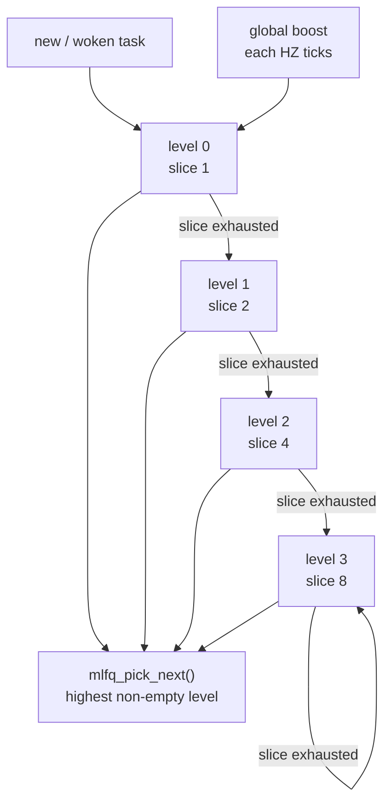
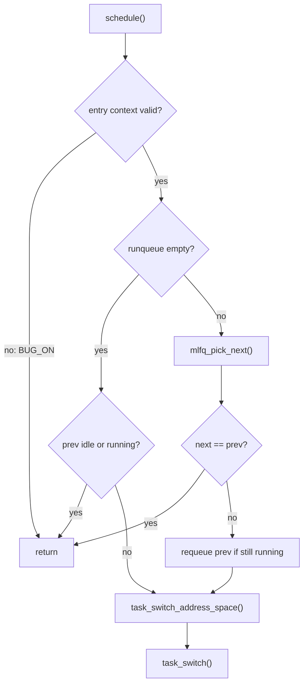

# 调度架构

cuteOS 当前调度器是单核、非抢占内核模型下的 4 级 MLFQ。timer tick 负责计费和提出重调度请求，真正的上下文切换只发生在显式调度入口或用户 trap 返回安全点。

## 代码边界

主要文件：

- `include/kernel/sched.h`：调度器公共 API。
- `sched/sched.c`：调度核心和架构切换编排。
- `sched/mlfq.c`：多级反馈队列策略。
- `sched/internal.h`：调度内部接口。
- `arch/riscv/switch.S`：低级 callee-saved 上下文切换。
- `arch/riscv/task.c`：地址空间切换和 task 架构状态。
- `kernel/waitqueue.c`：等待队列。
- `kernel/sync.c`：mutex。

调度器只负责选择 runnable task 和调用架构切换。task 生命周期、信号、futex、wait4 等语义不应塞进调度策略层。

## 单核假设

当前 `task_init()` 只让 CPU 0 online。调度器全局队列没有 per-CPU 分片，也没有跨 CPU 负载均衡。spinlock 和 wait channel 使用 irqsave 既保护中断上下文交错，锁字也使用原子竞争；但多核执行仍未启用。

`preempt_disable()` 增加当前 CPU 的 `preempt_count`；
`preempt_enable()` 递减该计数，并在计数归零、普通调度入口安全且当前任务
有 deferred reschedule request 时进入 `schedule()`。如果 IRQ 关闭、处于
hard IRQ、持有 spinlock 或仍不可抢占，请求会继续延后。IRQ handler 通过
独立的 `irq_enter()`/`irq_exit()` 维护 IRQ nesting，`in_irq()` 不读取或修改
`preempt_count`。`preemptible()` 只检查 `preempt_count`，不会把 IRQ
nesting 编码进抢占计数。

`schedule()` 是唯一的立即调度入口，只允许 task context、非 hard IRQ、无
held spinlock 且 `preempt_count == 0`；违反这些条件直接触发 `BUG_ON`。
本地 IRQ 可以开启或关闭，`schedule()` 保留进入时的 IRQ 状态，因此 trap
返回和其他 IRQ-off task handoff 不需要单独的入口。

`sched_context_can_schedule()` 是不改变状态的可返回 guard，描述
`schedule()` 的上下文前提，但不检查本地 IRQ 状态。`preempt_enable()` 仍只
在 IRQ enabled 的普通安全点消费 deferred reschedule request。
调度 core 本身不分配、不等待、不执行 I/O、reclaim 或 task reaping。

## 调度实体

`task_struct.sched` 包含：

```c
struct task_sched_entity {
    struct list_head run_list;
    volatile uint8_t need_resched;
    uint8_t sched_level;
    uint8_t time_slice;
    uint8_t sched_ticks;
    uint64_t enqueue_jiffies;
};
```

其中：

- `run_list` 是 MLFQ 队列节点。
- 等待注册不在调度实体中：`task_struct` 只通过 `wait_lock` 暂存 stable
  `active_wait` 指针供 exit 请求取消（见等待队列一节）。wait core 撤销 active
  wait 时先清理 channel registration，再调用 request 的 adapter cancellation
  callback；futex callback 在自身 bucket lock 下摘除 waiter 并释放 owner reference。
  callback 不在 channel lock 内执行，session 的 heap lifetime 由 owner、registration、
  timer 和 active-operation references 共同维持。
- `need_resched` 由 `sched_request()` 设置，用户 trap 返回点或显式调度点消费。
- `sched_level` 是 MLFQ 层级，0 最高。
- `time_slice` 是当前层剩余预算。
- `sched_ticks` 记录已用 tick。
- `enqueue_jiffies` 用于记录入队时间。

## MLFQ 策略

`SCHED_MLFQ_LEVELS = 4`。每级时间片为：



```c
slice(level) = 1 << level
```

即：

| level | tick 预算 |
| --- | --- |
| 0 | 1 |
| 1 | 2 |
| 2 | 4 |
| 3 | 8 |

`sched/mlfq.c` 维护：

- `queues[4]`：每级 FIFO list。
- `nonempty_bitmap`：快速查找非空队列。
- `runnable_count`：当前 runnable task 数。

入队规则：

- 新 task 从 level 0 开始。
- `mlfq_enqueue()` 加到当前 level 队尾。
- `mlfq_pick_next()` 从最低 level 数字的非空队列取队首，并出队。
- `mlfq_wakeup()` 保持 level，但刷新该 level 完整时间片。

tick 规则：

- 当前非 idle running task 每 tick 减少 `time_slice`。
- `time_slice` 到 0 时，如果未到最低优先级则 level++。
- 重置该 level 的时间片。
- 返回重调度需求给 generic scheduler，由 `sched_request()` 设置
  `need_resched=1`。

每当 `jiffies != 0` 且 `jiffies % HZ == 0`，执行全局 boost：所有队列中任务和当前 running task 回到 level 0。

## schedule() 的上下文契约与核心流程

`schedule()` 先验证上下文，再调用 `schedule_core()`：



1. 入口验证 current、hard IRQ、held lock 和 `preempt_count`；本地 IRQ 可以是
   任意状态且会被保持。
2. 清除当前 task 的 `need_resched`，取得 `prev = current_task()`。
3. 如果 runqueue 为空：
   - 当前是 idle 或仍 running，则继续运行。
   - 否则切到 idle。
4. 如果 runqueue 非空：
   - `next = mlfq_pick_next()`。
   - 如果 next 是 prev，返回。
   - 如果 prev 非 idle 且仍 running 且不在 runqueue，将 prev 重新入队。
   - `rseq_sched_switch(prev)`。
   - `set_current_task(next)`。
   - `task_switch_address_space(prev, next)`。
   - `task_switch(prev, next)`。

运行中的 task 通常不在 runqueue 中。被切走时，如果仍 `TASK_RUNNING`，调度器才重新入队。
退出 task 的 sibling thread reaping 由 idle loop 在调度器外执行；scheduler core
不拥有资源释放。

## 地址空间和上下文切换

调度核心通过架构层切换：

```c
void task_switch_address_space(const struct task_struct *prev,
                               const struct task_struct *next);
void task_switch(struct task_struct *prev,
                 struct task_struct *next);
```

地址空间切换选择 next 的 `satp`，若为 0 则使用 kernel page table。不同 `satp` 时写 CSR 并 flush TLB。

`switch.S` 只保存 callee-saved 上下文，即内核调度上下文；完整用户寄存器由 trap frame 保存，不由 context switch 保存。

## timer 抢占点

timer interrupt 中：

```text
handle_timer_irq()
  -> jiffies++
  -> timer_set(next)
  -> timer_run_expired(now)
  -> sched_tick()
```

如果 trap 来源是用户态，trap handler 在 `irq_exit()` 后进入统一的
`trap_user_return()`：先执行 `user_return_work()`，再在当前 task 有
`need_resched` 时调用 `schedule()`。同步 syscall、page fault 和 timer trap
共用这个 handoff；`schedule_core()` 负责消费请求。
这意味着用户代码可被 timer tick 抢占；内核代码不会在任意位置被异步抢占，
只在显式调用、等待路径或统一用户返回安全点切换。

## 主动让出 CPU

`sched_yield()`：

- 忽略 idle。
- 通过 `sched_request()` 提出请求。
- 直接调用 `schedule()`，由该入口保留当前 IRQ 状态。

当前任务在 `schedule()` 中如果仍 running 会被放回同级队尾。
yield 不主动降级，也不刷新剩余时间片。

## 等待队列

等待队列定义在 `include/kernel/wait.h`，实现位于 `kernel/waitqueue.c`。

基本对象和 interface：

```c
struct wait_channel {
    spinlock_t lock;
    struct list_head waiters;
};

struct wait_request {
    enum wait_kind kind;
    wait_check_fn check;
    wait_cancel_fn cancel;
    void *arg;
    uint32_t channel_limit;
};
```

wait module 只有一个通用阻塞 core：`wait_for()`。生产 adapter 通过
`wait_for_interruptible()`、`wait_for_killable()` 或
`wait_for_uninterruptible()` 进入固定策略入口；纯 mutex-like event 使用
`wait_event_uninterruptible()`，纯 deadline sleep 使用 `wait_sleep_until()`。
condition check 在拥有 event state 的 adapter 内检查或领取 event，并通过
opaque wait context 注册 wait channel。`kind` 是 wait outcome 的 dispatch
标签；条件对象本身仍由 adapter 拥有，其内部 check 只在 adapter 的 adapter
lock 下检查/领取并登记，锁顺序为 source lock 后 wait-channel lock。

等待流程由 wait module 统一拥有：

1. check 并 watch一个或多个 wait channel。
2. 设置 current task 为 interruptible 或 uninterruptible sleep。
3. 再次 check，关闭登记到真正阻塞之间的 lost-wakeup 窗口。
4. 按 `EVENT > SIGNAL > TIMEOUT` 选择 wait outcome。
5. 无 outcome 时调度或执行 WFI；无 event 的 wake 作为 spurious wake 内部重试。
6. 所有返回路径恢复 `TASK_RUNNING`，取消 timeout，并清理全部登记。

活动等待由 heap 上的 stable session 表示；current task 在 `wait_lock` 下暂存一个
opaque 指针，使 task exit 能在释放 sibling 内核栈前调用 `wait_cancel_task()`。
session 通过 `WAIT_ACTIVE`、`WAIT_CANCEL`、`WAIT_COMPLETING` 和
`WAIT_DONE` 收敛正常返回、取消、signal 与 timeout。每个成功登记的 wait entry
在链接到 channel 前先建立 session reference，随后再持有 task lifecycle reference；
wake 只摘除 entry，不转移或释放 entry owner reference，cleanup 在 channel lock 外
完成。deadline timer 的 callback 访问 stable session；`ktimer_cancel_sync()` 返回后，
timer、session 和 task 均不再被该 callback 访问。

wait module interface 包括：

```c
void wait_channel_init(struct wait_channel *channel);
int wait_session_watch(struct wait_session *session,
                  struct wait_channel *channel);
int wait_for_interruptible(const struct wait_request *request,
                  const struct wait_deadline *deadline,
                  wait_outcome_t *outcome);
int wait_for_killable(const struct wait_request *request,
                  const struct wait_deadline *deadline,
                  wait_outcome_t *outcome);
int wait_for_uninterruptible(const struct wait_request *request,
                  const struct wait_deadline *deadline,
                  wait_outcome_t *outcome);
int wait_event_uninterruptible(const struct wait_request *request);
int wait_sleep_until(const struct wait_deadline *deadline);
void wait_cancel_task(struct task_struct *task);
bool wait_channel_wake_one(struct wait_channel *channel);
void wait_channel_wake_all(struct wait_channel *channel);
```

所有 wait entry 都只能从 non-idle task context 调用，不能处于 hard IRQ、禁抢占
或持有 spinlock context；IRQ-off task context 仍可进入。违反这些契约会触发
`BUG_ON`。wait core 返回时恢复调用者进入前的本地 IRQ 状态，并清理等待
登记和 timeout。`wait_for()` 只供 wait implementation 和 white-box tests 使用，
生产 adapter 不应直接组合 flags。

wait outcome 是内核语义结果，不是 errno。sleep、futex、pipe、poll 和
child-wait adapter 分别把 EVENT、SIGNAL、TIMEOUT 映射为所属 ABI 的返回值。timeout
implementation 使用 ktimer；若 runqueue 为空且中断关闭，wait module 会临时
打开中断并执行 WFI，返回前恢复原 IRQ 状态。

唤醒只表示条件可能发生变化，不是完成凭证。wait outcome 在每次唤醒后
重新执行 condition check，因此虚假唤醒、重复唤醒和条件在注册后变化都走同一
条重试路径；所有返回路径撤销 registration、取消 timeout，并恢复
`TASK_RUNNING`。`WAIT_KIND_MUTEX`、`WAIT_KIND_FUTEX`、`WAIT_KIND_PIPE`、
`WAIT_KIND_POLL` 和 `WAIT_KIND_CHILD` 由各 adapter 标记，通用测试使用
`WAIT_KIND_GENERIC`。

## mutex

`kernel/sync.c` 实现的 mutex 建立在 spinlock 和 wait channel 之上：

```c
void mutex_init(mutex_t *mutex);
bool mutex_trylock(mutex_t *mutex);
void mutex_lock(mutex_t *mutex);
void mutex_unlock(mutex_t *mutex);
```

mutex 内部有：

- 自旋锁保护 owner 字段。
- wait channel 存放等待者。
- owner 必须是当前任务才能 unlock。

`mutex_lock()` 获取失败时，将当前任务加入 wait channel 并进入不可中断睡眠。
`mutex_unlock()` 先清空 owner 并释放 mutex source lock，再调用
`wait_channel_wake_one()`。

## 设计约束

- 调度策略不拥有 task 生命周期资源释放，exit 路径只通过状态和队列与调度器协作；
  idle loop 在安全上下文中执行 sibling thread reaping。
- 运行中 task 不应同时留在 runqueue。
- channel watch 属于一次 `wait_for()` invocation，不是 task 长期状态；stable
  session 只在该 invocation 期间存在，task 仅暂存用于 exit cancellation 的 opaque
  活动上下文。
- source、probe context、所有登记 wait channel 及其 owner 必须存活到等待返回。
- foreign `wait_cancel_task()` 只请求取消、唤醒 waiter 并等待 `WAIT_DONE`；waiter
  返回 `-ECANCELED` 时清零 outcome，adapter cleanup 仍由 wait core 的 waiter 路径完成。
- tick 只通过 `sched_request()` 设置重调度标志；不要在任意内核上下文引入异步抢占。
- `schedule()` 是唯一立即调度入口，允许 IRQ enabled 或 IRQ disabled 的 task
  context，并保持进入时的硬件 IRQ 状态。
- 多核支持不能只增加 `-smp`，还需要重新设计 runqueue、锁、current task 和 TLB shootdown。
