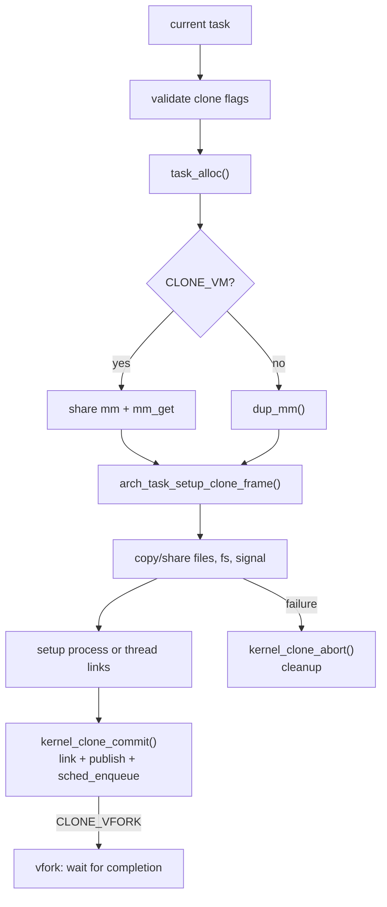
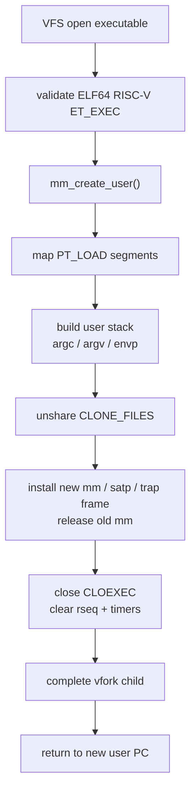
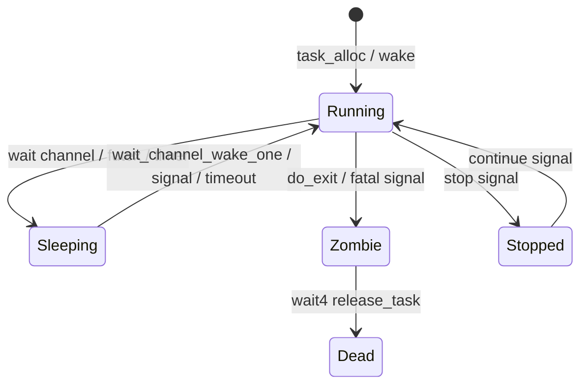

# 任务与内核核心服务

任务子系统负责进程/线程生命周期，并承载信号、futex、rseq、时间计时器、资源限制等与任务绑定的核心服务。`task_struct` 是这些状态的聚合根，但具体语义分散在对应子系统中。生命周期聚合、身份和通用资源连接可以留在 `task.h`；复杂语义和单一子系统字段访问应回到 owning subsystem 的头文件或实现内。

## task_struct 分组

`include/kernel/task.h` 将 `task_struct` 分为多个所有权清晰的子结构：

```mermaid
flowchart TB
    Task["task_struct"]
    Arch["arch<br/>context / tf / kstack / satp"]
    IDs["ids<br/>pid / tgid / pgid / sid"]
    Life["lifecycle<br/>state / exit_code"]
    Vfork["vfork<br/>completion state"]
    Links["links<br/>parent / children / thread group"]
    Res["resources<br/>mm / files / fs / sighand / signal"]
    Sig["sigctx<br/>blocked / pending / altstack / robust futex"]
    Rseq["rseq<br/>registered area / signature"]
    Sched["sched<br/>run_list / MLFQ state"]
    Time["cputime<br/>utime / stime"]
    Wait["wait_lock / active_wait<br/>active wait cancellation"]

    Task --> Arch
    Task --> IDs
    Task --> Life
    Task --> Vfork
    Task --> Links
    Task --> Res
    Task --> Sig
    Task --> Rseq
    Task --> Sched
    Task --> Time
    Task --> Wait
```



```c
struct task_struct {
    struct task_state arch;
    struct task_identity ids;
    struct task_lifecycle lifecycle;
    struct task_vfork_context vfork;
    struct task_links links;
    struct task_resources resources;
    struct task_signal_context sigctx;
    struct rseq_task_context rseq;
    struct task_sched_entity sched;
    struct task_cputime cputime;
    struct task_cputime child_cputime;
    struct restart_context restart;
    spinlock_t wait_lock;
    struct wait_session *active_wait;
};
```

主要分组：

- `arch`：RISC-V 上下文、trap frame、内核栈、`satp`。
- `ids`：`pid/tgid/pgid/sid/group_leader`。
- `lifecycle`：任务状态、退出码、退出信号和按 child 排序的 wait4 event FIFO。
- `vfork`：仅 vfork child 使用的 completion latch 与等待通道。
- `links`：父子链表、线程组链表、wait4 等待队列。
- `resources`：`mm/files/fs/sighand/signal/uid/gid`。
- `sigctx`：每线程信号状态、altstack、clear_child_tid、robust futex。
- `rseq`：restartable sequence 注册状态。
- `sched`：runqueue 节点、MLFQ 状态。
- `wait_lock/active_wait`：task-owned wait publication；wait module 将稳定
  session 指针发布到这里，exit 通过它请求取消，不能直接管理 session 内部资源。
- `cputime`：用户态/内核态 tick。

字段访问规则：

- `task.h` 只暴露生命周期聚合、`pid/tgid/pgid/sid`、父子/线程组连接、`mm/files/fs` 等跨子系统通用 helper。
- signal 相关 per-task helper 位于 `include/kernel/signal.h`。
- robust futex list 和 `clear_child_tid` helper 位于 `include/kernel/futex.h`。
- rseq 注册状态通过 `include/kernel/rseq.h` 的语义入口管理，字段级 helper 保持在 rseq 实现内部。
- scheduler 可以在 `sched/` 内直接访问 `task->sched`，task/fork/exit 可以在生命周期装配路径直接访问对应字段；其他模块不应为了方便绕过 owner API。
- task 模块拥有 parent/child relation source lock。它同时保护已发布任务的
  `parent/children/sibling` 链接、每个 child 的 wait4 event FIFO、事件 sequence/
  claim 和向 wait4 发布的 `TASK_ZOMBIE`；锁顺序固定为该 source lock 后 child
  wait channel lock。调用者通过 `task_child_event_claim_next()`、
  `task_child_event_watch()`、`task_child_event_commit()` 和
  `task_child_event_abort()` 观察、等待和完成事件，不能编排该锁或 IRQ flags。

新增 per-task 状态时，先说明 owner、生命周期和访问边界，再决定是否进入 `task_struct`。

## 任务状态

当前状态位：

| 状态 | 含义 |
| --- | --- |
| `TASK_RUNNING` | 可运行或正在运行 |
| `TASK_UNINTERRUPTIBLE` | 不可中断睡眠 |
| `TASK_INTERRUPTIBLE` | 可被未屏蔽信号打断的睡眠 |
| `TASK_KILLABLE` | 仅 pending `SIGKILL` 可打断的睡眠 |
| `TASK_ZOMBIE` | 已退出，等待父进程回收 |
| `TASK_DEAD` | 已被释放 |
| `TASK_STOPPED` | 被停止信号暂停 |

`TASK_ANY_SLEEP` 是全部睡眠状态的组合。等待队列和 mutex 通过这些状态与调度器交互。
task 退出时，exit 路径通过 `wait_cancel_task()` 请求 foreign active wait 取消，并在
session 到达 `WAIT_DONE` 后才继续资源清理。wait core 撤销 channel registration，
deadline timer 通过 cancel-sync 完成 callback 收敛，futex adapter 随后从 futex bucket
摘除对应 waiter；取消返回 `-ECANCELED`，因此正常返回和 task-exit cancellation 都
不会留下旧 task、owner ref 或旧 mm key。

## CPU-local current

`kernel/task.c` 定义：

```c
struct cpu cpu_table[NR_CPUS];
uint32_t nr_cpu_ids;
```

当前只初始化 CPU 0：

- `nr_cpu_ids = 1`
- `cpu_table[0].state = CPU_ONLINE`
- `cpu_table[0].idle_task = &idle_task`
- `cpu_table[0].current_task = &idle_task`

`current_task()`、`set_current_task()` 和 preempt count 都通过 CPU-local wrapper 访问。虽然结构保留了多 CPU 形态，但当前调度和锁语义仍是单核。

## task 分配与释放

`task_alloc()` 执行：

1. `kmalloc(sizeof(struct task_struct), ALLOC_NOWAIT)`
2. `get_free_page(KSTACK_ORDER, ALLOC_NOWAIT)` 分配 8 KiB 内核栈。
3. `alloc_pid()` 分配 PID。
4. 清零并初始化 task 字段。
5. `arch_task_init()` 初始化架构状态。
6. 设置默认 `tgid=pid`、`pgid=pid`、`sid=pid`、`group_leader=self`。
7. 初始化调度字段、链表、等待队列。
8. 清零内核栈。
9. 保留 PID，但保持 task 未发布。

`task_alloc()` 返回的 task 持有一个 creator base reference，且未出现在 PID
registry。fork 的 commit 和 kernel-thread 装配完成资源、父子/线程组 links 后才调用
`task_publish()`；此时才建立 PID 到 task 的映射并允许其他子系统查找。`task_free()`
只适用于未发布且仍只持有 base reference 的失败路径。

`task_find_thread()` 和 `task_find_group_leader()` 通过 PID registry 返回
lifecycle-pinned task，调用者必须配对 `task_put()`。reaper 先
`task_unpublish()` 使 PID 不再产生新引用，再 drop base reference；已有 lookup
reference 结束前对象和 PID 都不会释放或复用。registry mutex 只保护 PID 映射和 pin
取得，不替代后续 SMP 阶段的 parent/child、thread-group 或资源并发协议。

需要跨越一个锁外唤醒或通知阶段时，task module 使用
`task_try_get()` 获取不要求 PID published 的 lifecycle reference；`NULL` 返回
false，idle task 永久存活且不增加引用，普通 task 使用
`refcount_inc_not_zero()`。调用者必须为普通 task 配对 `task_put()`；该接口
不负责判断 PID registry 的 published 状态；PID lookup 在持有 registry lock
时完成 published 检查后直接使用该通用接口。

跨 subsystem 的进程身份读取只使用 `task_process_snapshot()`；SID/PGID 的 mutation
接口是 task module 私有接口，只由 session coordinator 调用。进程范围 signal policy
通过 `task_is_user_process()` 判断用户进程资格，不能直接依赖 `mm` resource 字段。
该角色由成功 exec 以原子发布建立，clone 在 publish 前继承；它此后仅为真，所以 PID
registry 的 lookup 引用可安全地读取它，即使 exit 已释放用户 mm。

idle task 是 BSS 静态对象，不通过 `task_alloc()`，也不拥有普通任务内核栈。

## 内核线程

`kernel_thread(fn, arg)` 创建内核线程：

1. `task_alloc()`
2. `task_init_resources()`
3. `task_setup_kthread(task, fn, arg)`
4. 挂到当前任务 children 链表。
5. `sched_enqueue(task)`

RISC-V 架构层在新任务内核栈顶部构造 trap frame，设置 `ctx.ra = __trapret`。首次调度切入后通过 `sret` 进入 `fn(arg)`。

PID 1 和 page cache 写回线程都是内核线程创建出来的。PID 1 随后 exec BusyBox
`/sbin/init`；内核不在创建时为它分配 controlling TTY。

## fork/clone

clone 实现位于 `kernel/fork.c`。核心 API：



```c
int kernel_clone_prepare(struct trap_frame *tf, unsigned long flags,
                         uintptr_t child_stack, uintptr_t tls,
                         int *clear_child_tid,
                         struct kernel_clone *clone);
pid_t kernel_clone_commit(struct kernel_clone *clone);
void kernel_clone_abort(struct kernel_clone *clone);
void kernel_clone_complete_vfork(struct task_struct *task);
```

clone 被拆成 prepare/commit/abort，便于 syscall 层在需要写用户 TID 或处理中间失败时保持一致性。
`kernel_clone_commit()` 也封装 vfork 调用任务的 completion 等待；exec/exit
只通过 `kernel_clone_complete_vfork()` 释放它，不接触调用任务的内核栈或等待队列内部状态。

当前 clone flag 策略：

- 支持 fork-like clone、pthread 所需线程子集，以及 non-thread vfork。
- 不支持 namespace、pidfd、ptrace、parent、io、clone3-only 等复杂
  flag；这些组合在 validator 中固定返回 `-EINVAL`。
- `CLONE_DETACHED` 和 `CLONE_UNTRACED` 在当前无 ptrace 模型下作为兼容
  no-op 接受。
- `CLONE_SIGHAND` 要求 `CLONE_VM`。
- `CLONE_VM` 要求显式 child stack；除 `CLONE_VFORK` 外还要求
  `CLONE_SIGHAND`。
- `CLONE_THREAD` 要求 `CLONE_VM | CLONE_SIGHAND`。
- `CLONE_VFORK | CLONE_THREAD` 返回 `-EINVAL`。non-thread vfork 调用任务在
  child 成功 exec 释放旧 mm 或 child exit 释放 mm 前保持 killable sleep；失败 exec
  不会完成等待，普通 signal 保持 pending，pending `SIGKILL` 则允许调用任务退出。
- 非线程 clone 只能由线程组 leader 发起。
- 非线程 clone 不接受 `CLONE_CHILD_SETTID/CLONE_CHILD_CLEARTID/CLONE_SETTLS` 这些线程专用 flag。

资源复制策略：

- `CLONE_VM` 共享 mm，否则 `dup_mm()` 深拷贝地址空间。
- `CLONE_FILES` 共享 fdtable，否则复制。
- `CLONE_FS` 共享 cwd/root/umask 状态，否则复制。
- `CLONE_SIGHAND` 共享 handler 表。
- `CLONE_THREAD` 共享 signal_struct，并加入 leader 的线程组；它通过 leader
  解析 controlling-TTY attachment，不复制 attachment。
- fork-like clone 由 TTY module 显式复制 leader 的 controlling-TTY attachment；
  allocation failure 会在 clone prepare 阶段回滚，attachment 不会随 signal state
  隐式复制。
- rseq 在 `CLONE_VM` 下清空，否则继承注册状态。

vfork completion state 属于 child：`active` 在 child publish 前初始化且随后不变；
source lock 只保护 completion latch，wait channel 只报告该 latch 可能变化。调用任务
在 source lock 仍持有时注册 wait channel，completion 先 latch 再唤醒，因此不会遗漏
先发生的 exec/exit completion。

## exec

exec 实现位于 `kernel/exec.c`。成功 exec 会替换当前任务的用户地址空间和 trap frame，但保留 PID、父子关系、打开文件等进程身份。



主要流程：

1. 通过 VFS 打开可执行文件。
2. 读取并验证 ELF64/RISC-V/ET_EXEC header。
3. 读取 program header table。
4. 创建新的 `mm_struct`。
5. 按 PT_LOAD 映射段，权限来自 ELF `p_flags`。
6. 构造 64 KiB 用户栈，写入 `argc/argv/envp`。
7. `mm_finalize()` 设置 `brk/code_start/code_end`。
8. 若 fdtable 由 `CLONE_FILES` 共享，为执行任务复制并安装私有 fdtable。
9. 安装新 `mm`、新 `satp` 和用户返回 trap frame，并释放旧 `mm`。
10. 在 fdtable lock 下解除并关闭 `CLOEXEC` fd，清理 rseq 和 POSIX timers。
11. 如果当前任务是 vfork child，完成其 vfork wait；调用任务只能在 fd
    close-on-exec 清理完成后恢复。

exec 后返回用户态时，`trap_setup_user_return()` 设置新的 PC/SP 和用户态 `sstatus`。

## exit/wait

退出实现位于 `kernel/exit.c`。



`do_exit(code)` 对当前任务执行：

1. 如果是线程组非 leader，退出当前线程。
2. 如果是 leader，先结束其他线程。
3. 执行 robust futex exit walk。
4. 处理 `clear_child_tid` 并 futex wake。
5. 在关闭资源前同步请求并完成 active wait cancellation；waiter 自己执行 registration、
   timer 和 adapter cleanup。
6. 关闭 fd、释放 fs；若退出进程是 controlling-TTY session leader，先通知 TTY
   module 解除整个 session 并向旧 foreground pgrp 发送 `SIGHUP`/`SIGCONT`。
7. 释放信号状态和 mm，并切回 kernel page table；若任务是 vfork child，完成 vfork
   wait。
8. task 模块将 leader 的子进程 reparent 给 `init_task` 或 idle，设置
   `TASK_ZOMBIE`，并向该 child 的 event FIFO 发布 exit edge。
9. task 模块为 parent 持有一个覆盖锁外 wait-channel wake 和 `SIGCHLD` 投递的
   lifecycle reference，然后释放 child-relation source lock；两项操作完成后
   统一释放该 reference。reparent 使用稳定的 `init_task` 或 idle 目标，并在
   解锁后唤醒对应 wait channel。
10. 调用 `schedule()`，由统一入口保留当前 IRQ 状态；该函数不再返回。

`do_exit_group(code)` 以线程组为单位终止。

`kernel_wait4()` 等待 pid `-1` 或正 pid 的子进程事件。每个 child 的 stop、continue
和 exit edge 进入 FIFO，并带递增 sequence；wait4 以 sequence claim 精确保留一个
event，避免同一 child 的连续状态边混淆。每个成功事件都会 snapshot child cputime 供
rusage 返回；仅 exit 回收时将其累加到父进程。`WUNTRACED` 选择 stop event，
`WCONTINUED` 选择 continue event。停止、继续和退出在 child-relation source lock
内发布并各自向 parent child wait queue 唤醒一次；重父化会将未消费 event 交给 adopter。
syscall adapter 仅在全部用户写回成功后 commit claim；任一 `-EFAULT` 都会 abort claim，
保留 event 供下一次 wait4 消费。阻塞等待使用 interruptible wait，未屏蔽 signal 返回
`-EINTR`（可由 `SA_RESTART` 重放）。`WNOHANG` 在有匹配子进程但尚无匹配事件时立即
返回 0，不注册 wait channel；无匹配子进程时仍返回 `-ECHILD`。`pid == 0` 和
`pid < -1` 的 process-group selector 当前明确返回 `-EINVAL`。

## PID 管理

PID 子系统位于 `kernel/pid.c` 和 `include/kernel/pid.h`。它用固定范围 bitmap 和 PID 到 task 映射管理任务查找。

任务创建时：

```text
alloc_pid()
pid_attach_task(pid, task)
```

任务释放时：

```text
pid_detach_task(pid, task)
free_pid(pid)
```

signal、tgkill、futex robust list 查询依赖 PID 映射；wait4 走父任务
children 链表与 per-child event FIFO，不查询 PID registry。

## 信号模型

信号实现位于 `kernel/signal.c`，公共 API 在 `include/kernel/signal.h`。

信号状态分三层：

- `sighand_struct`：可共享的 handler table，带 refcount 和 mutex。
- `signal_struct`：线程组共享 pending、itimers、POSIX timers、rlimits。
- `task_signal_context`：每线程 blocked/pending/in_handler/altstack/robust list。

关键 API：

```c
int signals_init(struct task_struct *task);
int signals_clone(struct task_struct *child, bool share_sighand,
                  bool share_signal, bool disable_altstack);
void signals_release(struct task_struct *task);
int send_signal(int sig, struct task_struct *task);
int send_group_signal(int sig, struct task_struct *leader);
int force_signal(int sig, struct task_struct *task);
int signal_sigsuspend(uint64_t mask);
int signal_wait_pending(uint64_t set, const struct timespec *timeout,
                        siginfo_t *info);
void do_signal(struct trap_frame *tf);
void signal_user_map_init(void);
```

信号投递发生在用户 trap 返回前。`do_signal(tf)` 查找未阻塞 pending 信号：

- 默认 fatal 信号调用 exit；PID 1 的默认 fatal action 被忽略。
- `SIGKILL` 和 `SIGSTOP` 不可阻塞、不可捕获。
- `SIGTSTP` 的默认 action 停止普通任务；有 handler 或被 ignore 时遵从该
  disposition。PID 1 的默认 `SIGTSTP` action 被忽略。
- ignored 信号清除 pending。
- handler 信号在用户栈或 altstack 上构造 `signal_frame`。

signal frame 保存原 trap frame、blocked mask、信号号和 altstack 状态。handler 返回时调用 signal trampoline 中的 `rt_sigreturn`，由 `do_sigreturn()` 恢复原始 trap frame 和 signal mask。

PID 1 保护位于默认 action 的执行点，而不是 pending 生成点。这样 blocked 的
SIGTERM/SIGUSR1/SIGUSR2 仍可由 BusyBox init 的 `sigtimedwait()` 消费；未处理的
默认 fatal signal（包括用户发送的 SIGKILL）不会结束 init。`force_signal*()` 通过
per-thread forced-pending 标记绕过该保护，避免把同步内核故障静默吞掉。

`kill(-1, sig)` 的进程选择属于 signal module：跳过 PID 1、调用线程组和未标记为
用户进程的 kernel-only task，再向每个用户线程组投递一次。角色不依赖当前 `mm`，
所以 exit teardown 不会改变该筛选；它也避免 writeback 等内核线程收到永远无法经过
用户返回路径处理的 pending signal。

`signal_sigsuspend()` 是 `rt_sigsuspend` 的 signal-policy seam。它安装完整的
临时 mask 后调用 generic interruptible wait；wait module 的二次 condition check
保证临时 mask 生效到 waiter 进入 sleep 的区间没有 lost wakeup。signal 打断后，它
将原 mask 延迟到 signal frame 建立时保存，使 handler 使用临时 mask，随后由
`rt_sigreturn` 恢复原 mask。

`signal_wait_pending()` 是同步 pending 消费与等待的 seam。它优先消费当前线程
pending，再消费线程组 shared pending；没有目标信号时临时从 blocked mask 移除等待
集合，并通过通用 wait module 处理目标信号唤醒、非目标信号中断和相对 deadline。
所有返回路径都会先恢复调用前 mask。syscall 层只负责 8 字节 sigset/timespec/
siginfo 的 Linux riscv64 ABI 复制。

`ppoll`、`pselect6`、`epoll_pwait` 的临时 signal mask 跨越 syscall 返回和
handler frame 建立：可投递 signal 打断等待时，frame 保存调用前的 mask，
handler 运行期间仍使用临时 mask，`rt_sigreturn` 再恢复调用前 mask。这样
signal 不会在 syscall 返回边缘被重新屏蔽。`SA_RESTART` 触发 syscall
restart：`do_signal()` 把该 flag 交给 `restart_for_signal()`，改写 trap-frame
PC/参数以重放阻塞 `read`/`write`/`wait4` 与无 timeout `FUTEX_WAIT`。

`rt_sigreturn` 只接受用户地址 PC，并校验 SP 对齐/可访问、`uc_flags`、
`uc_link`、altstack 与扩展区全零；恢复 blocked mask 时始终清除 `SIGKILL`
和 `SIGSTOP` 位。

`SIGNAL_TRAMPOLINE_ADDR = USER_STACK_GUARD_BASE - PAGE_SIZE`，通过 `user_map` 映射进每个用户页表。

## Session 和 controlling TTY

进程身份中的 SID/PGID 由 task module 在 `process_lock` 下读写；跨 subsystem 的读取
必须通过 `task_process_snapshot()` 取得同一临界区内的 pair，而不能分别读取两个字段。
`kernel/session.c` 的 session coordinator 为 `setsid`、`setpgid` 和 controlling-TTY
策略提供联合转换的线性化点。syscall 和 TTY input 都只进入该 coordinator。
controlling-TTY attachment 完全由唯一 console endpoint 的 TTY module 持有，并以
线程组 leader PID 为键；它不保存 `task_struct *`，也不进入 `task_resources`，其
生命周期只受 console TTY mutex 保护。

TTY 通过 coordinator 请求 foreground input signal；coordinator 在锁内从 TTY 快照
`(SID, PGID)`，解锁后调用 signal module 的 `send_session_pgrp_signal()`。signal
module 通过 lifecycle-pinned PID lookup 扫描并投递，因此 TTY 不会在持锁时遍历
task/PID 表或访问 signal state。当前锁顺序为 session coordinator -> task/process 或
TTY policy；task/process 与 TTY policy mutex 不嵌套。PID registry 仍仅由 task 和
signal 内部操作取得。

- fork-like 新进程由 session coordinator 在一个 prepare transaction 中复制父
  SID/PGID 与 controlling-TTY attachment；失败或 clone abort 必须完整移除该
  attachment。线程通过 group leader 查找 attachment，不复制它。
- `setsid()` 先创建新 SID/PGID，再解除调用进程的旧 controlling-TTY 关联；
  不发送 hangup，但若调用者是旧 foreground 组最后存活成员，旧 foreground
  PGID 会被清为 0。
- `TIOCSCTTY(0)` 仅允许 session leader 获取未占用 console。UID 0 的 session
  leader 可用 `TIOCSCTTY(1)` 清除旧 session 关联并强制接管；强制接管向旧
  foreground pgrp 发送 `SIGHUP`、`SIGCONT`；非 root 或参数 0 都不能抢占。
- 非 session leader 的 `TIOCNOTTY` 只清除调用进程的关联。session leader 的
  `TIOCNOTTY` 和 exit 都解除整个 session，并向旧 foreground pgrp 发送
  `SIGHUP`、`SIGCONT`。
- 任一线程组 leader exit 都在变为 zombie 前解除自身 attachment。session leader
  exit 同时解除整个 session，并立即释放该 session 的全部 attachment；reap 和
  clone abort 只作幂等资源兜底，不会重复正常 exit 的 hangup，因此 terminal 不会把
  输入信号投递给尚未被 parent 回收的已退出进程。
- terminal input signal 只投递给仍属于该 terminal session 的 foreground pgrp；
  不存在 owner 或 PGID/SID 已陈旧时返回 `-ESRCH`，不会按 PID 数字复用投递，也不
  会回退到当前 reader。当前无完整 process-group object；当 `setpgid`、
  `setsid` 或 exit 令 foreground pgrp 在该 session 中无存活成员时，coordinator
  将其清为 0，直到 `TIOCSPGRP` 显式选择新组。

当前只存在一个 UART terminal，`/dev/console` 同时承担系统 console。完整 ash job
control、getty/login、`/dev/tty`、多 terminal、后台读写限制和 orphaned pgrp 规则
均不在本轮范围内。

UART 仍采用 polling I/O。PID 1 创建后，TTY console 内核线程按 timer tick 轮询
UART，并在普通线程上下文执行行规程、echo 和前台组信号投递；`VINTR`、`VQUIT` 和
`VSUSP` 分别投递 `SIGINT`、`SIGQUIT` 和 `SIGTSTP`。TTY console read 通过共享
wait channel 作 interruptible wait。它不依赖 UART interrupt，且不会在内核态
busy-wait 阻止 PID 1 的 shutdown sleep 或其它 runnable task 前进。

## futex

futex 实现位于 `kernel/futex.c`。当前支持：

- `FUTEX_WAIT`
- `FUTEX_WAKE`
- `FUTEX_WAIT_PRIVATE` / `FUTEX_WAKE_PRIVATE`
- `FUTEX_WAIT_BITSET` / `FUTEX_WAKE_BITSET`
- robust futex list exit-time 处理

等待 key 是：

```c
struct futex_key {
    struct mm_struct *mm;
    uintptr_t uaddr;
};
```

这表示 futex wait channel 按地址空间和用户地址区分。当前没有跨进程共享内存的全局 inode key。
`FUTEX_PRIVATE_FLAG` 是 pthread 路径的稳定支持面。携带 `FUTEX_CLOCK_REALTIME`
的 op 固定返回 `-ENOSYS`（尚无随 wall-clock 重排的 futex deadline）。requeue
和 PI futex op 目前同样固定返回 `-ENOSYS`，避免误导 libc 探测。

`kernel_futex()` 根据 `FUTEX_CMD_MASK` 分发。普通 `FUTEX_WAIT/WAKE` 按
`FUTEX_BITSET_MATCH_ANY` 处理；`FUTEX_WAIT_BITSET/WAKE_BITSET` 在 waiter
中保存 bitset，wake 时只唤醒 bitset 相交的 waiter。`FUTEX_WAIT` 的
timeout 是 relative；`FUTEX_WAIT_BITSET` 的 timeout 是 absolute。

`FUTEX_WAIT` 和 `FUTEX_WAIT_BITSET` 会：

1. 校验地址对齐和 `access_ok()`。
2. `user_range_probe()` 确保可读。
3. 在 bucket lock 下再次读取用户值。
4. 值不等于 expected 返回 `-EAGAIN`。
5. 加入 waiter list，并进入 interruptible sleep。
6. 被 wake、signal 或 timeout 唤醒。

futex waiter 本身由稳定的 heap object 拥有，而不是由 `futex_wait()` 的调用栈
拥有。bucket lock 解锁后执行 wake 时会持有 waiter 临时 reference；调用者
完成 wait cleanup 并从 bucket 摘除后才释放 owner reference。

退出时 `futex_exit_robust_list()` 遍历用户 robust list，设置 `FUTEX_OWNER_DIED` 并唤醒等待者。

## rseq

rseq 实现位于 `kernel/rseq.c`。当前是单核兼容实现：

- `cpu_id_start = 0`
- `cpu_id = 0`
- `node_id = 0`
- `mm_cid = 0`

注册要求：

- area 非空。
- len 等于 32。
- area 按 32 字节对齐。
- 用户范围合法。
- syscall flags 只支持 `0` 和 `RSEQ_FLAG_UNREGISTER`，其它返回
  `-EINVAL`。

核心 API：

```c
ssize_t kernel_rseq(struct rseq *area, uint32_t len,
                    int flags, uint32_t sig);
void rseq_execve(struct task_struct *task);
void rseq_clone(struct task_struct *child,
                const struct task_struct *parent,
                unsigned long flags);
void rseq_sched_switch(struct task_struct *prev);
int rseq_resume_user(struct trap_frame *tf);
int rseq_signal_deliver(struct trap_frame *tf);
```

调度切换时，如果 prev 是从用户态 trap 进来的且注册了 rseq，则设置 `need_update`。返回用户态前 `rseq_resume_user()` 更新用户 rseq area，并在 PC 位于 critical section 时校验 abort signature，清除 `rseq_cs` 并把 `sepc` 改到 abort IP。
`rseq_cs` 的 `NO_RESTART_ON_PREEMPT` 和 `NO_RESTART_ON_SIGNAL` 会抑制
对应事件的 abort；`NO_RESTART_ON_MIGRATE` 在当前单核模型下是 no-op。
未知 `rseq_cs` flag 或非 0 version 会在 active CS 的用户返回处理中变成
`SIGSEGV` 退出。

exec 清除 rseq。`CLONE_VM` 清除 child rseq；fork-like clone 继承。

## 时间与计时器

架构 timer 在 `arch/riscv/timer.c`，通用时间核心在 `kernel/time.c`。

平台常量：

```c
#define HZ 100UL
#define MTIME_FREQ 10000000UL
#define CLOCKS_PER_TICK (MTIME_FREQ / HZ)
```

`timer_now()` 读取 `time` CSR，`timer_set()` 写 `stimecmp`。timer interrupt 每 10ms 触发一次。

通用 ktimer API：

```c
void ktimer_init(struct ktimer *timer, ktimer_fn_t function, void *arg);
int ktimer_arm(struct ktimer *timer, uint64_t expires, uint64_t interval);
bool ktimer_cancel(struct ktimer *timer);
int ktimer_cancel_sync(struct ktimer *timer);
void ktimer_run_expired(uint64_t now);
```

ktimer queue 按 `expires` 排序。timer interrupt 中调用 `ktimer_run_expired(now)`，周期 timer 会重新插入。
`ktimer_cancel()` 只撤销 queued timer；`ktimer_cancel_sync()` 还等待已经开始的
callback 完成，且只能在可调度 task context 调用。它允许 IRQ-off task handoff 并恢复
进入时的 IRQ 状态，但拒绝 hard IRQ、持锁、禁抢占和 callback self-cancel。

signal_struct 内包含：

- `itimers[ITIMER_COUNT]`
- `posix_timers`
- `rlimits`

`ITIMER_REAL` 和 POSIX timer 可通过 ktimer 向目标 task 投递信号。

## worker

`kernel/worker.c` 提供很小的周期 worker helper：

```c
void worker_run_periodic(unsigned int interval_sec,
                         void (*work)(void *),
                         void *arg);
```

它循环构造下一次 `wait_deadline`，通过 `wait_sleep_until()` 执行不可中断的纯
deadline wait，然后执行 work。page cache 写回线程用它每 5 秒调用一次全局同步。

## 设计约束

- task 是生命周期聚合根，但子系统语义应留在各自模块。
- `task.h` 不承载单一子系统的大批字段 helper；signal、futex、rseq 等 owner 头文件负责自己的 per-task helper。
- clone prepare/commit/abort 的事务边界不能被 syscall 层绕开。
- exec 成功后旧 `mm` 不再可用，后续代码不能访问旧用户地址。
- exit 在切换走前当前 task 已可能是 zombie 且无 mm，不要在 `do_exit()` 尾部新增用户访问。
- signal/rseq 的用户返回顺序是 ABI 语义的一部分。
- futex robust list 和 clear_child_tid 是 exit-time ABI 副作用，允许在 task teardown 中做 uaccess。
